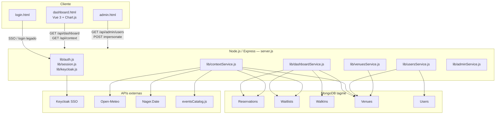
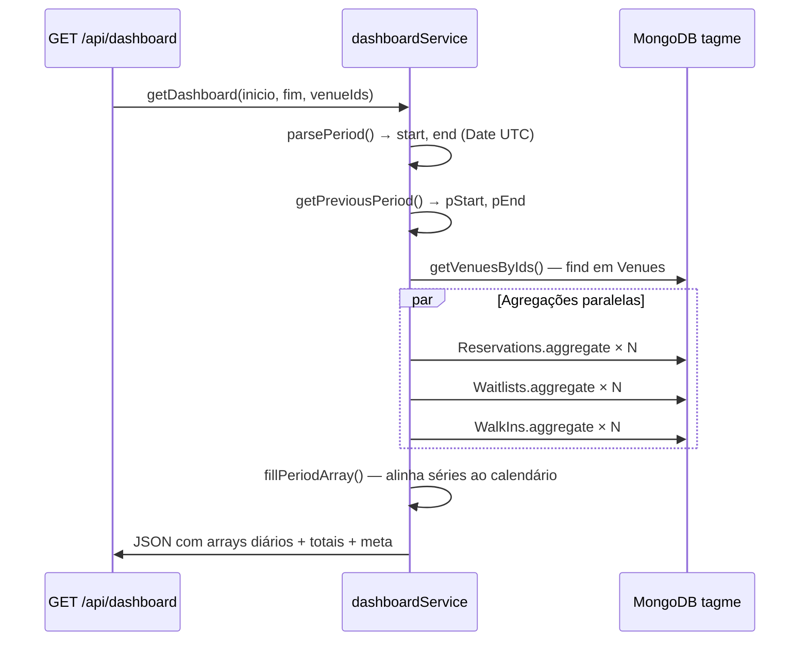

# Tagme Report — Documentação da Aplicação

Dashboard de Business Intelligence para análise de **reservas**, **fila de espera** e **fatores externos** das lojas Tagme. Conecta-se ao MongoDB operacional (`tagme`) e expõe uma API REST consumida por um frontend Vue 3 em página única.

**Última atualização:** junho/2026

---

## Índice

1. [Visão geral](#1-visão-geral)
2. [Stack e dependências](#2-stack-e-dependências)
3. [Arquitetura](#3-arquitetura)
4. [Estrutura do projeto](#4-estrutura-do-projeto)
5. [Configuração e execução](#5-configuração-e-execução)
6. [Autenticação e autorização](#6-autenticação-e-autorização)
7. [API REST](#7-api-rest)
8. [Frontend (dashboard)](#8-frontend-dashboard)
9. [Fontes de dados](#9-fontes-de-dados)
10. [Acesso ao MongoDB — como os dados são obtidos](#10-acesso-ao-mongodb--como-os-dados-são-obtidos)
11. [Regras de negócio](#11-regras-de-negócio)
12. [Serviços externos](#12-serviços-externos)
13. [Limitações conhecidas](#13-limitações-conhecidas)
14. [Documentação complementar](#14-documentação-complementar)

---

## 1. Visão geral

| Item | Valor |
|------|-------|
| Nome do pacote | `waitinglistreport` |
| Entry point | `server.js` |
| Porta padrão | `3847` |
| Database | MongoDB Atlas — database `tagme` |
| Timezone de negócio | `America/Sao_Paulo` (BRT) |
| Período máximo de consulta | 90 dias |
| Período padrão (sem filtro) | Últimos 7 dias |

O usuário seleciona **lojas** (venues) e um **período**; o backend agrega dados operacionais e devolve séries temporais, totais, rankings e comparativos com o período anterior de mesma duração.

---

## 2. Stack e dependências

### Backend

| Pacote | Uso |
|--------|-----|
| `express` | Servidor HTTP e rotas |
| `mongodb` | Driver MongoDB Atlas |
| `openid-client` | SSO Keycloak (OIDC + PKCE) |
| `cookie-parser` | Cookies de sessão |
| `cors` | CORS com credenciais |
| `dotenv` | Variáveis de ambiente |

### Frontend (`dashboard.html`)

| Biblioteca | Uso |
|------------|-----|
| Vue 3 (CDN) | Reatividade, filtros, abas |
| Axios (CDN) | Chamadas à API com cookies |
| Chart.js (CDN) | Gráficos de linha, barra, donut, heatmap |
| html2canvas + jsPDF (CDN) | Exportação PDF por aba |

### Páginas estáticas (`public/`)

| Arquivo | Função |
|---------|--------|
| `login.html` | Tela de login (SSO + legado) |
| `admin.html` | Painel admin — busca de usuários e impersonação |
| `theme.css` / `theme-init.js` | Tema claro/escuro |

---

## 3. Arquitetura



### Fluxo de dados principal

1. O usuário autentica-se (SSO Keycloak ou login legado em dev).
2. O frontend carrega `/api/me` para obter perfil e lojas permitidas.
3. Ao aplicar filtros, chama `GET /api/dashboard` e `GET /api/context` em paralelo.
4. `dashboardService` executa agregações MongoDB por período atual e período anterior.
5. O frontend renderiza KPIs, gráficos e rankings com Chart.js.

---

## 4. Estrutura do projeto

```
relatorioswhitelist/
├── server.js                 # Entry point — rotas HTTP
├── dashboard.html            # Dashboard principal (Vue SPA)
├── DOCUMENTATION.md          # Este arquivo
├── documento.md              # Documentação legada (parcialmente desatualizada)
├── colecoes.md                 # Catálogo MongoDB (138 coleções)
├── colecoes-estruturas.md      # Campos e tipos por coleção
├── colecoes-exemplos.json      # Exemplos JSON normalizados
├── .env.example                # Template de variáveis
├── package.json
├── public/
│   ├── login.html
│   ├── admin.html
│   ├── theme.css
│   └── theme-init.js
├── lib/
│   ├── mongo.js                # Conexão singleton MongoDB
│   ├── session.js              # Cookie assinado HMAC (bi_auth)
│   ├── auth.js                 # Middlewares, ACL de venues, impersonação
│   ├── keycloak.js             # OIDC Keycloak (PKCE)
│   ├── usersService.js         # Users + allowedUsers em Venues
│   ├── adminService.js         # Listagem de usuários para admin
│   ├── venuesService.js        # Busca e resolução de lojas
│   ├── dashboardService.js     # Agregações BI principais
│   ├── contextService.js       # Fatores externos (clima, feriados, eventos)
│   ├── customerTypeService.js  # Cliente primeira visita vs recorrente
│   ├── dates.js                # Períodos, timezone BRT, comparativo
│   ├── origins.js              # Agrupamento de canais de origem
│   ├── weatherService.js       # Open-Meteo por loja
│   ├── holidaysService.js      # Feriados BR + datas comemorativas
│   ├── eventsCatalog.js        # Eventos curados (Copa 2026, etc.)
│   └── units.js                # @deprecated — marcas vêm de Venues.parent
└── scripts/
    └── export-schemas.js       # Reexporta estruturas do MongoDB
```

---

## 5. Configuração e execução

### Instalação

```bash
cd /apps/2026/relatorioswhitelist
npm install
cp .env.example .env   # editar credenciais
npm start
```

### URLs locais

| URL | Descrição |
|-----|-----------|
| http://localhost:3847/ | Dashboard (requer login) |
| http://localhost:3847/login | Login |
| http://localhost:3847/admin | Painel administrador |
| http://localhost:3847/api/health | Health check |

### Variáveis de ambiente

| Variável | Obrigatória | Descrição |
|----------|-------------|-----------|
| `MONGODB_URI` | Sim | Connection string MongoDB Atlas |
| `MONGODB_DATABASE` | Não | Nome do database (padrão: `tagme`) |
| `PORT` | Não | Porta HTTP (padrão: `3847`) |
| `AUTH_SECRET` | Sim (prod) | Chave HMAC para assinar cookies de sessão |
| `SESSION_MS` | Não | TTL da sessão em ms (padrão: 7 dias) |
| `KEYCLOAK_ENABLED` | Não | `true`/`false` — ativa SSO (padrão: `true`) |
| `KEYCLOAK_ISSUER` | SSO | URL do realm Keycloak |
| `KEYCLOAK_CLIENT_ID` | SSO | Client ID OIDC |
| `KEYCLOAK_CLIENT_SECRET` | SSO | Secret (se confidential client) |
| `APP_BASE_URL` | SSO | URL base da aplicação |
| `KEYCLOAK_REDIRECT_URI` | SSO | Callback OIDC |
| `AUTH_LEGACY_ENABLED` | Não | Login local dev (padrão: `true`) |
| `AUTH_USER` / `AUTH_PASS` | Dev | Credenciais do login legado |
| `NODE_ENV` | Não | `production` ativa cookie `secure` |

---

## 6. Autenticação e autorização

### Modos de login

| Modo | Quando | Comportamento |
|------|--------|---------------|
| **SSO Keycloak** | `KEYCLOAK_ENABLED=true` | OIDC com PKCE; e-mail do token é resolvido em `Users` |
| **Login legado** | `AUTH_LEGACY_ENABLED=true` | POST `/api/login` com usuário/senha fixos; `bypassAcl: true` |

### Sessão

- Cookie `bi_auth`: payload JSON em base64url + assinatura HMAC-SHA256.
- Cookie `bi_oidc`: estado temporário do fluxo SSO (10 min).
- Todas as rotas `/api/*` protegidas usam `requireAuth` (JSON 401) ou `requireAuthPage` (redirect `/login`).

### Controle de acesso por loja (ACL)

- Usuários SSO: lojas permitidas = venues onde `Venues.allowedUsers` contém o `Users._id`.
- Admin legado (`bypassAcl`): acesso a qualquer loja na busca e nos filtros.
- Admin impersonando: vê apenas as lojas do usuário impersonado.
- `assertVenueAccess(req, venueIds)` valida cada ID antes de consultar o MongoDB.

### Impersonação (admin)

1. Admin acessa `/admin`.
2. `POST /api/admin/impersonate/:userId` cria sessão com `impersonating: true`.
3. `POST /api/admin/stop-impersonate` restaura sessão do admin.

---

## 7. API REST

Base URL: `/api` (ou `http://localhost:3847/api` em dev).

Todas as rotas abaixo (exceto health e auth config) exigem cookie de sessão válido.

### Saúde e configuração

#### `GET /api/health`

Sem autenticação.

```json
{
  "ok": true,
  "ts": "2026-06-16T12:00:00.000Z",
  "sso": true,
  "legacyAuth": true
}
```

#### `GET /api/auth/config`

Sem autenticação. Usado pela tela de login.

```json
{
  "sso": true,
  "legacyAuth": true,
  "loginUrl": "/auth/keycloak/login"
}
```

---

### Autenticação

#### `GET /login`

Página HTML de login.

#### `GET /auth/keycloak/login`

Inicia fluxo OIDC; redireciona para Keycloak.

#### `GET /auth/keycloak/callback`

Callback OIDC; cria sessão e redireciona para `/?sso=1`.

#### `POST /api/login`

Login legado (somente se `AUTH_LEGACY_ENABLED=true`).

**Body:** `{ "user": "admin", "password": "..." }`

**Resposta 200:** perfil do usuário legado.

**Erros:** `401` credenciais inválidas; `403` legado desabilitado.

#### `POST /api/logout`

Encerra sessão. Se SSO com `idToken`, retorna `logoutUrl` para logout no Keycloak.

#### `GET /api/me`

Perfil do usuário autenticado.

**Resposta:**

```json
{
  "ok": true,
  "user": "Nome",
  "email": "user@empresa.com",
  "userId": "...",
  "role": "...",
  "venueCount": 5,
  "bypassAcl": false,
  "auth": "sso",
  "isAdmin": false,
  "impersonating": false,
  "venues": [{ "id": "...", "nome": "Loja", "grupoLabel": "Grupo" }]
}
```

---

### Lojas

#### `GET /api/venues/search`

Busca lojas por nome/slug para o seletor de filtros.

| Parâmetro | Tipo | Descrição |
|-----------|------|-----------|
| `q` | string | Termo de busca (mín. 2 caracteres) |
| `limit` | number | Máx. resultados (1–50, padrão 40) |

**Resposta:**

```json
{
  "venues": [
    {
      "id": "62600ec3b6a45b0012602f61",
      "nome": "Moma Itaim",
      "shortName": null,
      "slug": "moma-itaim",
      "parentId": "...",
      "grupoLabel": "Moma Osteria"
    }
  ]
}
```

- Admin não impersonando: busca em todas as venues ativas (`disabled ≠ true`).
- Usuário comum: filtra apenas `session.venueIds`.

---

### Dashboard (métricas BI)

#### `GET /api/dashboard`

Agregações principais de reservas, fila, walk-ins e rankings.

| Parâmetro | Tipo | Obrigatório | Descrição |
|-----------|------|-------------|-----------|
| `inicio` | `YYYY-MM-DD` | Não* | Data inicial inclusiva (BRT) |
| `fim` | `YYYY-MM-DD` | Não* | Data final inclusiva (BRT) |
| `venues` ou `venue` | string | **Sim** | IDs separados por vírgula |

\* Se omitidos, usa últimos 7 dias. Máximo 90 dias.

**Comparativo:** período anterior com a mesma duração imediatamente antes de `inicio`.

**Resposta — estrutura principal:**

| Campo | Descrição |
|-------|-----------|
| `labels` | Eixo X diário (`dd/mm`), tamanho `dayCount` |
| `mesLabels` | Eixo X mensal (`mm/yyyy`) |
| `reservas` / `res_p` | Volume diário de reservas (atual / anterior) |
| `fila` / `fil_p` | Volume diário de fila |
| `walkin` / `walkin_p` | Walk-ins diários |
| `sr` / `sr_p` | Reservas sentadas (`status: Seated`) |
| `nr` / `nr_p` | No-show reservas (`status: Canceled`) |
| `ar` / `ar_p` | Reservas abertas (demais status) |
| `sf` / `sf_p` | Fila atendida (`seatedAt` preenchido) |
| `nf` / `nf_p` | No-show fila (`canceledAt` sem `seatedAt`) |
| `tempo` / `tem_p` | Tempo médio de espera (min/dia) |
| `pessoas` / `pes_p` | Pessoas em reservas |
| `filaPessoas` / `filaPessoas_p` | Pessoas na fila |
| `hora` / `hor_p` | Distribuição horária da fila (24 posições) |
| `res_hora` / `res_hor_p` | Distribuição horária das reservas |
| `hora_heat` / `res_hora_heat` | Heatmap dia×hora (7×24) |
| `nsr` / `nsr_p` | Taxa no-show reservas % (Canceled / total) |
| `res_mes` / `fila_mes` | Séries mensais |
| `origem` | Canais de reserva (Widget, Manual, Google, Parceiros) |
| `origemFila` | Canais da fila (Waitlist, Widget, Google) |
| `origemDetalhe` | Top 20 labels brutos de `origin.label` |
| `clienteRes` / `clienteFila` | Primeira visita vs recorrente |
| `unidades` | Ranking por loja (res, fila, pessoas, tempo) |
| `canal` | % canal por loja (barras empilhadas) |
| `totais` | Somas do período |
| `periodo` / `periodoAnterior` | Metadados dos intervalos |
| `meta` | Venues, timezone, `atualizadoEm` |

**Erros:** `400` período inválido ou sem lojas; `401`/`403` auth/ACL.

---

### Fatores externos

#### `GET /api/context`

Análise contextual: clima, feriados, eventos e impacto em reservas/fila.

Mesmos parâmetros de período e `venues` que `/api/dashboard`.

**Resposta — estrutura principal:**

| Campo | Descrição |
|-------|-----------|
| `periodo` | Intervalo e labels |
| `baseline` | Médias do período (reservas, fila, pessoas) |
| `reservas`, `pessoas`, `fila`, `filaPessoas` | Séries diárias |
| `days[]` | Um objeto por dia com tags, clima por loja, deltas |
| `groups[]` | Estatísticas por grupo (normal, feriado, chuva, evento, fim de semana…) |
| `highlights[]` | Dias especiais com maior desvio |
| `weatherAlerts[]` | Alertas de chuva por loja/dia |
| `geo` | Coordenadas das lojas |
| `sources` | Origem dos dados externos e thresholds de chuva |
| `meta` | Venues e timestamp |

**Grupos de análise (`groups.key`):**

| Chave | Critério |
|-------|----------|
| `normal` | Sem tag especial, sem fim de semana, sem chuva |
| `feriado` | Feriado nacional (Nager.Date) |
| `comemorativo` | Data comemorativa (Dia das Mães, Natal…) |
| `feriado_comemorativo` | União feriado + comemorativo |
| `evento` | Catálogo curado (`eventsCatalog.js`) |
| `chuva` | Precipitação ≥ 10 mm em alguma loja |
| `fim_semana` | Sábado ou domingo (BRT) |

---

### Administração

Requer sessão admin (`bypassAcl` ou impersonator admin).

#### `GET /admin`

Página HTML do painel admin.

#### `GET /api/admin/users`

| Parâmetro | Descrição |
|-----------|-----------|
| `q` | Busca por e-mail/nome (mín. 2 chars) |
| `venueQ` | Filtra usuários com loja que case o termo |
| `page` | Página (listagem por venue access) |
| `limit` | Itens por página (máx. 100) |

**Resposta:**

```json
{
  "items": [
    {
      "userId": "...",
      "email": "user@tagme.com",
      "name": "Usuário",
      "role": "...",
      "venueCount": 3,
      "venueIds": ["..."],
      "venues": [{ "id": "...", "nome": "Loja", "grupoLabel": "Grupo" }]
    }
  ],
  "total": 42,
  "page": 1,
  "hasMore": false
}
```

#### `POST /api/admin/impersonate/:userId`

Inicia impersonação. Resposta inclui `redirect: "/?viewAs=1"`.

#### `POST /api/admin/stop-impersonate`

Restaura sessão do administrador. Resposta: `redirect: "/admin"`.

---

### Páginas e redirects

| Rota | Auth | Ação |
|------|------|------|
| `GET /` | Sim | `dashboard.html` |
| `GET /dashboard` | Sim | `dashboard.html` |
| `GET /dashboard_restaurante_bi.html` | Não | Redirect 301 → `/` |

---

## 8. Frontend (dashboard)

Arquivo monolítico: `dashboard.html` (HTML + CSS + Vue 3 + Chart.js).

### Abas

| Aba | ID | Conteúdo |
|-----|-----|----------|
| Visão Geral | `geral` | KPIs consolidados, gráficos resumo, walk-ins |
| Reservas | `reservas` | Métricas e gráficos de reservas, origem, cliente novo/recorrente |
| Fila de Espera | `fila` | Fila, tempo médio, heatmap horário, no-show |
| Visão Mensal | `mensal` | Agregações por mês |
| Ranking | `ranking` | Rankings lado a lado: reservas e fila (critérios configuráveis) |
| Canais Detalhados | `canais` | Origem detalhada e canal por loja |
| Fatores Externos | `contexto` | Clima, feriados, eventos; consome `/api/context` |

### Filtros

- **Período:** presets (7d, 30d, mês atual…) ou datas customizadas.
- **Lojas:** busca assíncrona via `/api/venues/search`; multi-seleção com chips.
- Labels **Filtrado** / **Comparado** exibidos nos cards e gráficos.

### Comportamento

- Dados carregados sob demanda (`loadData()`); sem auto-reload periódico.
- Rodapé atualiza data/hora a cada 30s (`tick()`).
- Exportação PDF por aba (`html2canvas` + jsPDF).
- Tema claro/escuro via `public/theme-init.js`.

### Convenção de cores nos gráficos

| Cor | Significado |
|-----|-------------|
| Laranja | Período filtrado (atual) |
| Azul | Período comparado (anterior) |
| Verde / cinza | Pessoas atual / anterior |
| Vermelho (`#FF0000`) | No-show |

---

## 9. Fontes de dados

### MongoDB — coleções utilizadas

| Coleção | Volume aprox. | Uso na aplicação |
|---------|---------------|------------------|
| `Reservations` | ~17M | Reservas, status, origem, pessoas, horários |
| `Waitlists` | ~35M | Fila de espera, tempo, atendimento, cancelamento |
| `WalkIns` | variável | Entrada direta sem fila (complementar) |
| `Venues` | ~28k | Nomes, grupo (`parent`), geo (`location`), ACL (`allowedUsers`) |
| `Users` | — | Autenticação SSO, impersonação, admin |

### Campos-chave

#### `Reservations`

| Campo | Uso |
|-------|-----|
| `venue` | ObjectId → `Venues._id` |
| `reservationDay` | Data da reserva (agrupamento diário) |
| `reservationTime` | Hora da reserva (heatmap) |
| `partySize` | Número de pessoas |
| `status` | `Seated`, `Canceled`, `New`, `Confirmed`, etc. |
| `origin.label` | Canal de origem |
| `customer` | Cliente (primeira visita vs recorrente) |

#### `Waitlists`

| Campo | Uso |
|-------|-----|
| `venue` | ObjectId da loja |
| `created_at` | Entrada na fila |
| `seatedAt` | Cliente atendido |
| `canceledAt` | Cancelamento / desistência |
| `waitingTime` | Minutos de espera (ou calculado vs `seatedAt`) |
| `partySize` | Pessoas no grupo |
| `origin.label` | Origem (Waitlist, Widget, Google) |
| `status` | Status operacional (`green`, `red`, `orange`) |
| `customer` | Classificação de cliente |

#### `Venues`

| Campo | Uso |
|-------|-----|
| `name.pt` / `shortName.pt` | Nome exibido |
| `parent` | ObjectId do grupo/marca |
| `location` | `[lon, lat]` para clima |
| `allowedUsers` | Array de ObjectId → ACL |
| `disabled` | Venues inativas são excluídas |

#### `Users`

| Campo | Uso |
|-------|-----|
| `email` / `username` | Login SSO |
| `name` | Nome exibido |
| `role` | Papel no Tagme Manager |
| `disabled` | Usuários inativos ignorados |

### Coleções analisadas mas não usadas no dashboard

| Coleção | Motivo |
|---------|--------|
| `bi_reservation_venue` / `bi_waitlist_venue` | Dados congelados (~2016–2022) |
| `NewWaitlists` | Vazia |
| `Logs` (`pageView`) | Tracking descontinuado (abr/2024) |
| `LiveMenu` | Configuração, não métrica de acesso |
| `Channels` | Catálogo de parceiros, não origem operacional |

Detalhes completos: [`colecoes.md`](./colecoes.md).

### Seleção dinâmica de lojas

O mapeamento fixo em `lib/units.js` está **deprecado**. Grupos/marcas vêm do campo `Venues.parent`; o usuário busca e seleciona lojas individualmente conforme sua ACL.

---

## 10. Acesso ao MongoDB — como os dados são obtidos

Esta seção descreve **de que forma** o backend lê o MongoDB: conexão, tipos de operação, padrões de filtro, pipelines de agregação e transformação do resultado em JSON para o dashboard.

### 10.1 Conexão

Arquivo: `lib/mongo.js`

```javascript
// Singleton — uma conexão reutilizada por todo o processo Node
const client = new MongoClient(process.env.MONGODB_URI);
await client.connect();
const db = client.db(process.env.MONGODB_DATABASE || 'tagme');
```

| Aspecto | Detalhe |
|---------|---------|
| Driver | `mongodb` v7 (API nativa, sem ODM/ORM) |
| Database | `tagme` (configurável via `MONGODB_DATABASE`) |
| Escrita | **Nenhuma** — a aplicação só **lê** dados |
| IDs | Strings da API são convertidas com `toObjectIds()` → `ObjectId` do MongoDB |
| Pool | Gerenciado pelo driver; conexão aberta no primeiro `connect()` |

### 10.2 Fluxo geral por requisição



O mesmo padrão vale para `GET /api/context`, que além do MongoDB consulta APIs externas de clima e feriados.

### 10.3 Padrão de filtro — sempre o mesmo esqueleto

Toda consulta operacional combina **lojas** + **intervalo de datas**:

```javascript
// Lojas selecionadas pelo usuário (após ACL em server.js)
const match = {
  venue: { $in: [ObjectId("..."), ObjectId("...")] },
  reservationDay: { $gte: start, $lt: end },   // Reservations
  // ou
  created_at: { $gte: start, $lt: end },         // Waitlists / WalkIns
};
```

| Campo de data | Coleção | Significado |
|---------------|---------|-------------|
| `reservationDay` | `Reservations` | Dia civil da reserva (BRT via `$dateToString`) |
| `created_at` | `Waitlists`, `WalkIns` | Momento de entrada na fila / walk-in |

**Conversão de período:**

1. `inicio`/`fim` chegam como `YYYY-MM-DD` (query string).
2. `lib/dates.js` converte para `Date` UTC representando meia-noite BRT (`03:00 UTC`).
3. O filtro MongoDB usa intervalo **semiaberto** `[start, end)` — o dia `fim` é inclusivo na UI, mas `end` no código é o dia seguinte às 03:00 UTC.

### 10.4 Tipos de operação MongoDB usados

| Operação | Onde | Para quê |
|----------|------|----------|
| `collection.aggregate([...])` | `dashboardService`, `contextService`, `customerTypeService`, `adminService` | **Principal** — contagens, somas, médias, agrupamentos |
| `collection.find({...})` | `venuesService`, `usersService` | Busca de lojas, usuários, coordenadas |
| `collection.findOne({...})` | `usersService` | Login SSO — resolver usuário por e-mail |
| `collection.countDocuments({...})` | `aggregateFutureReservations` | Totais de reservas futuras (sem agrupar) |
| `collection.distinct('customer', {...})` | `customerTypeService` | Lista de clientes ativos no período |
| Cursor `for await` | `aggregateCustomerType` | Itera documentos do período em streaming (evita carregar tudo na RAM de uma vez) |

Não há `insert`, `update`, `delete` nem `bulkWrite` em nenhum serviço.

### 10.5 Pipeline de agregação — padrão repetido

A grande maioria das métricas segue este pipeline de **2 estágios**:

```javascript
db.collection('Reservations').aggregate([
  { $match: { venue: { $in: venueIds }, reservationDay: { $gte: start, $lt: end } } },
  { $group: { _id: <chave>, count: { $sum: 1 } } },
]).toArray();
```

Variações do `_id` no `$group`:

| `_id` | Resultado |
|-------|-----------|
| `$dateToString` em `reservationDay` / `created_at` | Série **diária** (`2026-06-15`) |
| `$month` + `$year` (via `monthGroup`) | Série **mensal** (`2026-06`) |
| `$venue` | Total **por loja** (ranking) |
| `$origin.label` | Distribuição por **canal** |
| `$status` | Breakdown por **status** |
| `$hour` / `{ dow, hour }` | Distribuição **horária** e heatmap 7×24 |
| `{ venue, origin }` | Canal **por loja** |
| `{ c: '$customer', v: '$venue' }` | Primeira visita do cliente na unidade |
| `null` | **Total único** do período |

Agregações com estágios extras:

```javascript
// Tempo médio de espera — calcula minutos antes de agrupar
{ $addFields: { waitMin: waitMinutesExpr } },
{ $match: { waitMin: { $gt: 0, $lte: 720 } } },
{ $group: { _id: '...', avg: { $avg: '$waitMin' } } }

// Hora da reserva — reservationTime pode ser string "19:30" ou Date
{ $addFields: { resHour: reservationHourExpr } },
{ $match: { resHour: { $gte: 0, $lte: 23 } } },
```

### 10.6 Execução paralela

`dashboardService.buildPeriodData()` dispara **dezenas de agregações em paralelo** com `Promise.all`:

```javascript
const [res, resPrev, wl, wlPrev, wi, wiPrev, resFuturo, unidades, canal, ...] =
  await Promise.all([
    aggregateReservations(db, venueIds, start, end, ...),      // ~20 pipelines
    aggregateReservations(db, venueIds, pStart, pEnd, ...),  // período anterior
    aggregateWaitlists(db, venueIds, start, end, ...),       // ~15 pipelines
    aggregateWaitlists(db, venueIds, pStart, pEnd, ...),
    aggregateWalkIns(db, venueIds, start, end, ...),
    aggregateFutureReservations(db, venueIds),
    buildVenueRanking(db, venues, ...),
    buildCanalPorVenue(db, venues, ...),
    buildFirstVisitMap(...),  // 2× (reservas + fila)
  ]);
```

Cada função `aggregateReservations` / `aggregateWaitlists` internamente também usa `Promise.all` para rodar todos os `$group` do mesmo domínio ao mesmo tempo.

**Período comparado:** toda métrica `*_p` (ex.: `res_p`, `fil_p`) vem de uma segunda rodada de agregações com `pStart`/`pEnd` — período de mesma duração imediatamente anterior.

### 10.7 Pós-processamento em Node (não no MongoDB)

O MongoDB devolve linhas esparsas (`{ _id: "2026-06-03", count: 42 }`). O Node.js **preenche arrays densos** alinhados ao calendário:

```javascript
// indexByYmd = { "2026-06-01": 0, "2026-06-02": 1, ... }
const arr = Array(dayCount).fill(0);
for (const row of rows) {
  const idx = indexByYmd[row._id];
  if (idx !== undefined) arr[idx] = row.count;
}
```

| Função | Uso |
|--------|-----|
| `fillPeriodArray(rows, indexByYmd)` | Série diária com um valor por dia do período |
| `fillMonthArray(rows, indexByYm)` | Série mensal |
| `fillHoraArrays(rows)` | Array de 24 posições (0h–23h) |
| `fillHoraHeatmap(rows, indexByYmd)` | Matriz 7×24 (dia da semana × hora), normalizada pela quantidade de cada dia da semana no período |
| `originsToPercent(counts)` | Converte contagens de canal em percentuais |
| `origins.js` | Reagrupa `origin.label` brutos em Widget / Manual / Google / Parceiros |

O JSON final enviado ao frontend é **arrays numéricos prontos para Chart.js**, não documentos MongoDB crus.

### 10.8 Consultas por endpoint / serviço

#### `GET /api/dashboard` → `lib/dashboardService.js`

| Bloco | Coleção(ões) | Operação | Filtros adicionais |
|-------|--------------|----------|-------------------|
| Reservas diárias, status, pessoas | `Reservations` | `aggregate` | `status: Seated / Canceled / abertas` |
| Fila diária, tempo, pessoas | `Waitlists` | `aggregate` | `seatedAt`, `canceledAt` |
| Walk-ins | `WalkIns` | `aggregate` | — |
| Reservas futuras (+30 dias) | `Reservations` | `countDocuments` + `aggregate` | `reservationDay` ≥ hoje |
| Ranking por loja | `Reservations`, `Waitlists` | `aggregate` `$group` por `$venue` | — |
| Canal por loja | `Reservations` | `aggregate` por `{ venue, origin }` | — |
| Cliente novo vs recorrente | `Reservations`, `Waitlists` | `distinct` + `aggregate` + cursor | histórico de `customer` |
| Nomes das lojas | `Venues` | `find` por `_id` | — |

#### `GET /api/context` → `lib/contextService.js`

| Bloco | Fonte | Operação |
|-------|-------|----------|
| Reservas/fila por dia | `Reservations`, `Waitlists` | `aggregate` `$group` por dia |
| Nomes e geo das lojas | `Venues` | `find` (`location` para clima) |
| Clima | Open-Meteo (externo) | HTTP — **não** MongoDB |
| Feriados | Nager.Date (externo) | HTTP |
| Eventos | `eventsCatalog.js` | Arquivo local |

#### `GET /api/venues/search` → `lib/venuesService.js`

```javascript
db.collection('Venues').find({
  disabled: { $ne: true },
  $or: [
    { 'name.pt': /regex/i },
    { 'shortName.pt': /regex/i },
    { slug: /regex/i },
    { search: /regex/i },
  ],
}).project({ name: 1, parent: 1, slug: 1 }).limit(N).toArray();
```

Depois resolve `parent` com segundo `find` para obter `grupoLabel`.

#### Autenticação → `lib/usersService.js`

```javascript
// Usuário SSO
db.collection('Users').findOne({ email: /.../i, disabled: { $ne: true } });

// Lojas permitidas — ACL invertida: busca venues que listam o usuário
db.collection('Venues').find({
  disabled: { $ne: true },
  allowedUsers: ObjectId(userId),
}).project({ _id: 1 }).toArray();
```

#### Admin → `lib/adminService.js`

```javascript
// Usuários com acesso a lojas — unwind de allowedUsers
db.collection('Venues').aggregate([
  { $match: { allowedUsers: { $exists: true, $ne: [] } } },
  { $unwind: '$allowedUsers' },
  { $group: { _id: '$allowedUsers', rawVenueIds: { $addToSet: '$_id' } } },
]);
```

### 10.9 Exemplos concretos de pipeline

**Volume diário de reservas:**

```javascript
db.Reservations.aggregate([
  { $match: {
      venue: { $in: [ObjectId("62600ec3...")] },
      reservationDay: { $gte: ISODate("2026-06-01T03:00:00Z"), $lt: ISODate("2026-06-17T03:00:00Z") }
  }},
  { $group: {
      _id: { $dateToString: { format: "%Y-%m-%d", date: "$reservationDay", timezone: "America/Sao_Paulo" } },
      count: { $sum: 1 }
  }}
])
// → [{ _id: "2026-06-01", count: 87 }, { _id: "2026-06-03", count: 102 }, ...]
// → Node preenche → reservas: [87, 0, 102, ...]  (0 nos dias sem dados)
```

**Fila atendida (sentada) por dia:**

```javascript
db.Waitlists.aggregate([
  { $match: {
      venue: { $in: [...] },
      created_at: { $gte: start, $lt: end },
      seatedAt: { $exists: true, $ne: null }
  }},
  { $group: { _id: <dia BRT>, count: { $sum: 1 } }}
])
```

**No-show na fila:**

```javascript
{ $match: {
    canceledAt: { $exists: true, $ne: null },
    $or: [{ seatedAt: { $exists: false } }, { seatedAt: null }]
}}
```

**Primeira visita do cliente (pesado — usa disco):**

```javascript
db.Reservations.aggregate([
  { $match: { venue: { $in: [...] }, customer: { $in: activeCustomers } } },
  { $group: {
      _id: { c: "$customer", v: "$venue" },
      firstYmd: { $min: { $dateToString: { format: "%Y-%m-%d", date: "$reservationDay", timezone: "America/Sao_Paulo" } } }
  }}
], { allowDiskUse: true })
```

### 10.10 Formato da resposta (o que sai do MongoDB vs o que vai ao frontend)

| Camada | Formato |
|--------|---------|
| MongoDB `$group` | Documentos esparsos: `{ _id: <chave>, count: N, pessoas?: N, avg?: N }` |
| Node.js pós-processo | Arrays densos indexados por dia/mês/hora |
| API JSON | Objeto flat com ~80 chaves numéricas + objetos `origem`, `unidades`, `meta` |
| Frontend | Lê arrays diretamente nos datasets do Chart.js |

Exemplo — o MongoDB **não** devolve isto:

```json
{ "reservas": [{ "dia": "2026-06-01", "total": 87 }] }
```

Devolve isto (após `fillPeriodArray`):

```json
{
  "labels": ["01/06", "02/06", "03/06"],
  "dayCount": 3,
  "reservas": [87, 0, 102],
  "res_p": [61, 55, 98],
  "meta": { "fonte": "MongoDB tagme", "timezone": "America/Sao_Paulo" }
}
```

### 10.11 Performance e índices

| Prática | Detalhe |
|---------|---------|
| Filtro por `venue` | Sempre presente — reduz scan às lojas selecionadas |
| Filtro por data | Segundo predicado em todo `$match` |
| `allowDiskUse: true` | Apenas em `buildFirstVisitMap` (histórico de clientes) |
| Timeout frontend | 120 segundos (`axios` timeout em `/api/dashboard` e `/api/context`) |
| Índices recomendados | `{ venue: 1, reservationDay: 1 }`, `{ venue: 1, created_at: 1 }` |
| Sem cache de API | Cada `loadData()` refaz todas as agregações |

---

## 11. Regras de negócio

### Períodos (`lib/dates.js`)

- Todas as datas são interpretadas em **BRT** (`America/Sao_Paulo`).
- Intervalo MongoDB: `[start, end)` — `end` é exclusivo (dia seguinte 03:00 UTC).
- Período anterior: mesma duração imediatamente antes de `inicio`.
- Default: últimos 7 dias. Máximo: 90 dias.

### Reservas

| Métrica | Regra |
|---------|-------|
| Total | Count por `reservationDay` no período |
| Sentadas | `status === 'Seated'` |
| No-show | `status === 'Canceled'` |
| Abertas | Status diferente de `Seated` e `Canceled` |
| Taxa no-show | `Canceled / total` ou `Canceled / (Seated + Canceled)` |
| Futuras | Reservas com `reservationDay` após o fim do período |

### Fila de espera

| Métrica | Regra |
|---------|-------|
| Total | Count por `created_at` |
| Atendidas | `seatedAt` presente |
| No-show | `canceledAt` presente e `seatedAt` ausente |
| Tempo médio | `waitingTime` se > 0; senão `(seatedAt - created_at)` em minutos; apenas atendidos; cap 720 min |

### Walk-ins

- Coleção `WalkIns`; volume complementar (entrada direta sem passar pela fila).

### Canais de origem (`lib/origins.js`)

**Reservas:**

| Canal UI | Labels MongoDB (`origin.label`) |
|----------|----------------------------------|
| Widget | contém `widget` |
| Manual | `phone`, `telefone`, `presencial` |
| Google | contém `google` |
| Parceiros | demais (Bradesco, whatsapp, instagram…) |

**Fila:**

| Canal UI | Labels |
|----------|--------|
| Waitlist | padrão |
| Widget | contém `widget` |
| Google | contém `google` |

### Cliente primeira visita vs recorrente

- Para cada par `(customer, venue)`, calcula o primeiro dia histórico.
- No período: **primeira** = dia igual ao primeiro; **recorrente** = dia posterior.

### Clima (`lib/weatherService.js`)

- Consulta **Open-Meteo** por coordenada de cada loja (`Venues.location`).
- Cache em memória: 6h (clima), 24h (feriados).
- Chuva: ≥ **10 mm**/dia; muito chuvoso: ≥ **20 mm** ou código de tempestade.

### Feriados e eventos

- Feriados nacionais: API [Nager.Date](https://date.nager.at/) (`/PublicHolidays/{year}/BR`).
- Comemorativos: calculados (Dia das Mães, Black Friday, Natal…).
- Eventos: catálogo estático em `lib/eventsCatalog.js` (Copa 2026, Carnaval…).

---

## 12. Serviços externos

| Serviço | Endpoint / origem | Uso | Timeout |
|---------|-------------------|-----|---------|
| Keycloak | `KEYCLOAK_ISSUER` | SSO OIDC | — |
| Open-Meteo | `api.open-meteo.com` | Precipitação e temperatura | 12s |
| Nominatim | `nominatim.openstreetmap.org` | Nome da região (reverse geocode) | 12s |
| Nager.Date | `date.nager.at/api/v3` | Feriados BR | 12s |

---

## 13. Limitações conhecidas

1. **Performance** — `Waitlists` tem ~35M documentos; consultas longas podem levar alguns segundos. Timeout do frontend: 120s.
2. **No-show reservas** — usa `Canceled` como proxy; `New`/`Confirmed` não comparecidos não entram como no-show.
3. **Views LiveMenu** — não integrado; `Logs.pageView` descontinuado globalmente.
4. **Walk-ins** — volume baixo em muitas redes; métrica complementar.
5. **Clima** — depende de `Venues.location`; lojas sem geo não recebem dados meteorológicos.
6. **Eventos** — catálogo manual; requer manutenção periódica em `eventsCatalog.js`.
7. **Login legado** — apenas para desenvolvimento; desabilitar em produção (`AUTH_LEGACY_ENABLED=false`).

---

## 14. Documentação complementar

| Arquivo | Conteúdo |
|---------|----------|
| [`colecoes.md`](./colecoes.md) | Inventário completo das 138 coleções MongoDB |
| [`colecoes-estruturas.md`](./colecoes-estruturas.md) | Campos, tipos e referências por coleção |
| [`colecoes-exemplos.json`](./colecoes-exemplos.json) | Documentos de exemplo normalizados |
| [`documento.md`](./documento.md) | Documentação inicial do projeto (parcialmente desatualizada) |
| [`.env.example`](./.env.example) | Template de configuração |
| [`scripts/export-schemas.js`](./scripts/export-schemas.js) | Reexportar schemas do cluster |

```bash
# Atualizar catálogo MongoDB
node scripts/export-schemas.js
```

---

*Tagme Report — projeto `relatorioswhitelist` — gerado em junho/2026*
