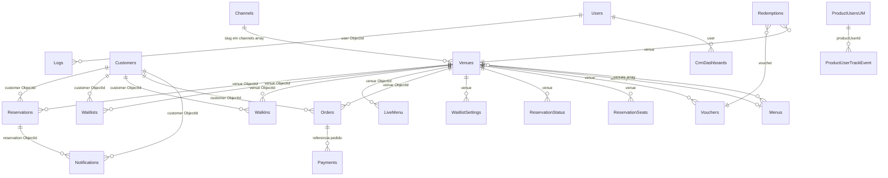

# MongoDB `tagme` — Catálogo de Coleções

Revisão do database **tagme** (cluster `tagmeprodnew6.wjrdk.mongodb.net`) para o projeto Impettus BI.  
**138 coleções** inventariadas. **Revalidado em 16/06/2026** com consultas diretas ao cluster.

### Documentação relacionada

| Arquivo | Conteúdo |
|---------|-----------|
| **[`colecoes-estruturas.md`](./colecoes-estruturas.md)** | Tabelas de **campos, tipos e referências** por coleção |
| **[`colecoes-exemplos.json`](./colecoes-exemplos.json)** | **Exemplo JSON** de cada coleção (ObjectId/Date normalizados) |
| [`scripts/export-schemas.js`](./scripts/export-schemas.js) | Script para reexportar estruturas + exemplos do MongoDB |

```bash
node scripts/export-schemas.js   # atualiza colecoes-estruturas.md e colecoes-exemplos.json
```

---

## 0. Validação dos dados deste documento

| Afirmação | Resultado da checagem | Observação |
|-----------|----------------------|------------|
| 138 coleções no database | Confirmado | `listCollections()` |
| `Reservations` ~17,4M docs | Confirmado | `estimatedDocumentCount` ≈ 17.426.699 |
| `Waitlists` ~35M docs | Confirmado | ≈ 35.035.532 |
| `Logs` ~11,3M docs | Confirmado | ≈ 11.325.497 |
| `Venues` ~28.479 docs | Confirmado | ≈ 28.479 |
| `bi_*` sem dados Impettus | Confirmado | `venue_id` ∈ IDs Impettus → **0** em `bi_reservation_venue` e `bi_waitlist_venue` |
| `bi_reservation_venue` até set/2022 | Confirmado | min 2002, max 2022-09-06 |
| `bi_waitlist_venue` até jun/2020 | Confirmado | min 2016-02, max 2020-06-01 |
| `NewWaitlists` vazia | Confirmado | 0 documentos |
| Último `Logs.pageView` | Confirmado | **2024-04-26** (global) |
| `pageView` Impettus 2025+ | Confirmado | **0** |
| `ProductUserTrackEvent` Impettus 2026 | Confirmado | **0** com `venueId` das 9 venues |
| 9 venues Impettus em `lib/units.js` | Confirmado | 9 IDs mapeados; **9/9** existem em `Venues` |
| `LiveMenu` Impettus | Confirmado | **4/9** venues (D'Heaven, D'Heaven SP, Moma Itaim, Moma Pinheiros) |
| Ligação `Reservations.venue` → `Venues` | Confirmado | amostra Impettus resolve `_id` |
| Ligação `Reservations.customer` → `Customers` | Confirmado | `customer` é ObjectId válido |
| Ligação `Waitlists.venue` → `Venues` | Confirmado | amostra Impettus resolve `_id` |
| Ligação `Venues.menu` → `Menus` | Confirmado | quando `menu` existe, aponta para doc em `Menus` |
| Ligação `Venues.channels[]` → `Channels.slug` | Confirmado | slug do array bate com doc em `Channels` |
| Ligação `Notifications.reservation` → `Reservations` | Confirmado | `reservation` é ObjectId válido |
| Ligação `ProductUserTrackEvent.productUserId` → `ProductUsersUM` | Confirmado | ObjectId válido |
| `Redemptions.customer` → `Customers` | **Parcial** | `customer` é **subdocumento** (`customer.customer`, etc.), não ObjectId direto |
| `Logs.venue` → `Venues` | **Opcional** | muitos `Logs` têm só `user` → `Users`, sem `venue` |
| Contagens Impettus totais | Aproximado | scans em `Reservations`/`Waitlists` são lentos; valores abaixo vêm de queries com timeout parcial |

### Volumes Impettus (9 venues) — números verificados

| Métrica | Valor | Período |
|---------|-------|---------|
| Reservas | ~50.700 | Total histórico (todas as datas) |
| Reservas | ~1.400 | Ex.: 01–16/06/2026 (via API dashboard) |
| Fila de espera | ~330.000 | Total histórico |
| Fila de espera | ~27.700 | Ano 2026 |
| Walk-ins | ~18 | Ano 2026 |
| Views LiveMenu | 0 | 2025+ |

> **Correção em relação à v1:** a frase “~50.725 no período consultado” estava imprecisa — esse número é o **total histórico** das 9 venues em `Reservations`, não de um período específico.

---

## 1. De onde o dashboard obtém dados hoje

| Indicador / gráfico | Coleção atual | Campo-chave | Arquivo no projeto |
|---------------------|---------------|-------------|-------------------|
| Total reservas, sentados, no-show, pessoas, origem | `Reservations` | `venue`, `reservationDay`, `status`, `partySize`, `origin.label` | `lib/dashboardService.js` |
| Fila de espera, tempo médio, pico por hora, origem fila | `Waitlists` | `venue`, `created_at`, `seatedAt`, `canceledAt`, `waitingTime`, `partySize`, `origin.label` | `lib/dashboardService.js` |
| Views LiveMenu | `Logs` | `type: 'pageView'`, `venue`, `created_at` | `lib/dashboardService.js` |
| Nome das unidades | `Venues` | `_id`, `name.pt` | `lib/venuesService.js` |
| Canal % por venue | `Reservations` | `venue` + `origin.label` | `lib/dashboardService.js` |

### Conclusão da revisão

As coleções **operacionais** (`Reservations`, `Waitlists`, `Venues`) são a fonte correta para dados recentes das unidades Impettus (2025–2026). Não há substituto melhor entre as demais coleções para reservas e fila.

| Alternativa analisada | Veredicto |
|----------------------|-----------|
| `bi_reservation_venue` / `bi_waitlist_venue` | Dados **congelados** (até ~2020–2022). **0 registros** das venues Impettus. Não usar para BI atual. |
| `NewWaitlists` | **Vazia** (0 documentos). |
| `Waitlists_CocoBambu` / `Reservations_CocoBambu` | Fork de outro cliente (Coco Bambu). Sem dados Impettus. |
| `WalkIns` | Entrada direta sem fila. **~18** registros Impettus em 2026. Complementar, não substitui `Waitlists`. |
| `Logs` (`pageView`) | Tracking **descontinuado** globalmente desde abr/2024 (último `pageView`: 26/04/2024). **0 views** Impettus em 2025+. |
| `ProductUserTrackEvent` | Sucessor provável do `Logs` para LiveMenu (`LIVEMENU_*`). Porém **0 eventos** com `venueId` Impettus em 2026. |
| `LiveMenu` | Configuração do cardápio digital por venue (4 unidades Impettus). **Não é** métrica de acesso. |
| `Channels` | Catálogo de **15 parceiros** (Bradesco, Esfera, Resy…). Não é origem de reserva/fila. |
| `Reports` | Relatórios pré-gerados (blob `data`). Uso pontual, não tempo real. |
| `ReservationsDashboardDays` | Layout de seções do painel operacional por dia. **Não contém métricas**. |
| `ReservationStatus` | Disponibilidade / antecedência de reserva por dia. Configuração, não volume. |

**Recomendação:** manter `Reservations` + `Waitlists` + `Venues`. Para **views LiveMenu**, investigar com o time Tagme se o tracking migrou para outro pipeline (analytics externo, `ProductUserTrackEvent` sem `venueId`, ou app mobile). Até lá, o gráfico de views ficará zerado por ausência de dados, não por coleção errada.

---

## 2. Diagrama de relacionamentos (núcleo operacional)

Relações **confirmadas** em amostras reais do cluster.



### Tabela de chaves estrangeiras (operacional)

| De | Campo | Para | Tipo | Obrigatório? |
|----|-------|------|------|--------------|
| `Reservations` | `venue` | `Venues._id` | ObjectId | Sim |
| `Reservations` | `customer` | `Customers._id` | ObjectId | Quase sempre |
| `Waitlists` | `venue` | `Venues._id` | ObjectId | Sim |
| `Waitlists` | `customer` | `Customers._id` | ObjectId | Frequente |
| `WalkIns` | `venue` | `Venues._id` | ObjectId | Sim |
| `Venues` | `menu` | `Menus._id` | ObjectId | Opcional |
| `Menus` | `venues[]` | `Venues._id` | ObjectId[] | Relação inversa |
| `Venues` | `channels[]` | `Channels.slug` | String[] | Opcional |
| `LiveMenu` | `venue` | `Venues._id` | ObjectId | Sim |
| `Logs` | `venue` | `Venues._id` | ObjectId | **Opcional** |
| `Logs` | `user` | `Users._id` | ObjectId | Frequente |
| `ProductUserTrackEvent` | `venueId` | `Venues._id` | **String hex** | Opcional |
| `ProductUserTrackEvent` | `productUserId` | `ProductUsersUM._id` | ObjectId | Sim |
| `Notifications` | `venue`, `customer`, `reservation` | `Venues`, `Customers`, `Reservations` | ObjectId | Conforme tipo |
| `Orders` | `venue`, `customer` | `Venues`, `Customers` | ObjectId | Sim |
| `Redemptions` | `venue`, `voucher` | `Venues`, `Vouchers` | ObjectId | Sim |
| `Redemptions` | `customer` | subdocumento | Objeto | **Não é FK direta** |

### BI legado — tipo de chave diferente

| De | Campo | Tipo | Nota |
|----|-------|------|------|
| `bi_reservation_venue` | `venue_id` | String | Não cruza direto com `Venues._id` sem conversão |
| `bi_waitlist_venue` | `venue_id` | String | Idem |

**Chave dominante:** `venue` (ObjectId) → `Venues._id`.  
**Cliente:** `customer` (ObjectId) → `Customers._id`.

---

## 3. Coleções do dashboard — detalhamento

### `Reservations` (~17,4M docs)

Reservas de mesa no produto Tagme.

| Campo | Tipo / valores | Uso BI |
|-------|----------------|--------|
| `venue` | ObjectId | Filtro unidade |
| `reservationDay` | Date | Agrupamento diário/mensal |
| `reservationTime` | Date | Horário da reserva |
| `partySize` | Number | Pessoas |
| `status` | `Seated`, `Canceled`, `New`, `Confirmed`, `Overbook`, `Pending` | Sentado / no-show |
| `origin.label` | String | Canal (Widget, Phone, google, Bradesco…) |
| `origin.app` | String | App de origem |
| `customer` | ObjectId → `Customers` | CRM (não usado no BI hoje) |
| `seatedAt`, `canceledAt` | Date | Timestamps de desfecho |
| `section` | String | Salão / área |
| `google` | Object | Integração Reserve with Google |

**Impettus (9 venues mapeadas):** ~50,7 mil reservas no **total histórico**; ~27,7 mil filas em **2026**. Dados ativos confirmados via API em jun/2026.

---

### `Waitlists` (~35M docs)

Fila de espera digital.

| Campo | Tipo / valores | Uso BI |
|-------|----------------|--------|
| `venue` | ObjectId | Filtro unidade |
| `created_at` | Date | Entrada na fila |
| `partySize` | Number | Pessoas no grupo |
| `seatedAt` | Date | Atendido |
| `canceledAt` | Date | Cancelado / desistência |
| `waitingTime` | Number | Minutos até sentar |
| `status` | `green`, `red`, `orange` | Estado operacional (cor) |
| `origin` | Objeto `{ label }` ou legado | `Restaurant`, `Widget`, `Google Waitlists` |

Estrutura real: `origin.label` (objeto), não string solta no root.

**Impettus:** ~330 mil filas no total histórico; ~27.670 em 2026. Origem dominante em 2026: `Restaurant` (>99%), depois `Widget`.

---

### `Logs` (~11,3M docs)

Eventos de telemetria legada.

| Campo | Uso |
|-------|-----|
| `type` | `pageView` (LiveMenu), outros tipos minoritários |
| `venue` | Unidade — **campo opcional** |
| `origin` | Ex.: `Menu Personnalite` |
| `user` | ObjectId → `Users` (comum quando não há `venue`) |
| `created_at` | Data do evento |

**Problema:** `pageView` parou globalmente em **abr/2024**. Muitos documentos **não têm** `venue` — a ligação com `Venues` é parcial. Para LiveMenu atual, ver `ProductUserTrackEvent` (também sem dados Impettus em 2026).

---

### `Venues` (~28.479 docs)

Cadastro mestre de restaurantes.

| Campo | Relação |
|-------|---------|
| `_id` | PK usada em todo o sistema |
| `name`, `shortName` | Nome i18n (`pt`, `en`…) |
| `menu` | → `Menus._id` |
| `channels[]` | Parceiros habilitados (slug → `Channels`) |
| `has.waitlist`, `has.reservation`, `has.digitalMenu` | Features ativas |
| `features`, `integrations` | Configurações |
| `loyaltySettings` | Programa fidelidade |

**Impettus:** 9 IDs em `lib/units.js`; CIATC ausente. **LiveMenu** configurado em 4 venues: D'Heaven, D'Heaven SP, Moma Itaim, Moma Pinheiros (Mané e Moma Jardins sem doc em `LiveMenu`).

---

### `WalkIns` (~8,5M docs)

Cliente sentado **sem** passar pela fila digital (entrada direta / hostess).

Estrutura similar a `Waitlists` (`venue`, `partySize`, `seatedAt`, `origin`). Volume Impettus irrelevante frente à fila.

---

### `LiveMenu` (~19k docs)

Configuração do cardápio digital por venue (`pro`, `settings.callWaiter`, `settings.pdvIntegration`).  
Relação: `LiveMenu.venue` → `Venues._id` (1 documento de config por venue ativa). **Não armazena pageviews.**

---

### `ProductUserTrackEvent` (~5,1M docs)

Eventos de produto unificado (substituto em evolução do `Logs`).

| Campo | Descrição |
|-------|-----------|
| `eventType` | `LIVEMENU_LEGACY_OPEN_MENU`, `RESERVATION_ENTER`, `WAITLIST_ENTER`, etc. |
| `venueId` | String (hex do `_id` da venue) | Quando rastreado |
| `productUserId` | ObjectId → `ProductUsersUM` | Usuário do produto |
| `createdAt` | Date | Timestamp |

> **Atenção:** `venueId` é **string**, não ObjectId — ao cruzar com `Venues`, comparar com `Venues._id.toString()`.

Candidata futura para views LiveMenu (`LIVEMENU_LEGACY_OPEN_MENU`, `LIVEMENU_OPEN_MENU`), mas **sem eventos Impettus** em 2026.

---

## 4. Coleções BI legadas (`bi_*`)

Views/materializações antigas. Campo `venue_id` é **string**, diferente do `venue` ObjectId do operacional.

| Coleção | Docs (aprox.) | Período dos dados | Campos principais |
|---------|---------------|-------------------|-------------------|
| `bi_reservation_venue` | 3,2M | 2002 – set/2022 | `venue_id`, `reservationDay`, `status`, `origin.label`, `turno` |
| `bi_waitlist_venue` | 2,7M | 2016 – jun/2020 | `venue_id`, `created_at`, `status`, `turno` |
| `bi_walkIns_venue` | 209k | não revalidado | `venue_id`, `seatedAt`, `turno` |
| `bi_reservationStatus_venue` | 2,1M | — | `venue_id`, `reservationDay`, `schedules` |
| `bi_venues` | 14,8k | — | Catálogo BI (`venue_id`, `nom_restaurante`) |
| `bi_customer_venue` | 250k | — | `customer_id`, `venue_id`, fidelidade |
| `bi_redemptions` | 2,8k | — | Resgates de prêmios |

**Nenhuma contém `venue_id` das unidades Impettus** (testado com os 9 IDs de `lib/units.js`). Útil só para histórico de outros clientes Tagme.

---

## 5. Configuração operacional (ligadas a `Venues`)

| Coleção | Função | Ligação |
|---------|--------|---------|
| `ReservationStatus` | Disponibilidade e regras de reserva **por dia** | `venue` + `reservationDay` |
| `ReservationSeats` | Capacidade, seções, intervalos de reserva | `venue` |
| `ReservationsDashboardDays` | Seções exibidas no painel do dia | `venue` + `reservationDay` |
| `ReservationBlockades` | Bloqueios de horário | `venue` |
| `ReservationTables` | Mesas físicas | `venue` |
| `AvailabilitiesDay` | Disponibilidade por origem/canal | `venue` + `day` |
| `WaitlistSettings` | Config da fila (tempos médios, tamanhos de grupo) | `venue` |
| `WaitlistsCMPArrived` | Subconjunto fila com chegada confirmada (CMP) | `venue`, `arrivedAt` |

Não substituem contagem de reservas/fila; explicam **por que** certos comportamentos existem.

---

## 6. Clientes, identidade e CRM

| Coleção | Docs (aprox.) | Descrição | Ligações |
|---------|---------------|-----------|----------|
| `Customers` | 29,5M | Cliente final (nome, phone, email, `venues[]`) | ← Reservations, Waitlists, Orders |
| `Users` | 150k | Usuário backoffice / gestor | ← CrmDashboards, Logs |
| `ProductUsersUM` | 1M | Identidade unificada multi-produto | → ProductUserTrackEvent |
| `ProductUserLoginHistory` | 2,2M | Logins em produtos | `productUserId` |
| `ManagerUsers` | — | Gestores de venue | — |
| `CrmDashboards` | 1,3k | Preferências de dashboard CRM por user+venue | `user`, `venue` |
| `CrmCategories` | — | Categorias CRM | — |
| `CustomerTabs` | — | Abas customizadas de cliente | — |
| `CustomerRating` | — | Avaliação de cliente | — |
| `Registrations` | — | Cadastros | — |

---

## 7. Cardápio, pedidos e pagamentos

| Coleção | Docs (aprox.) | Descrição | Ligações |
|---------|---------------|-----------|----------|
| `Menus` | 1,3M | Cardápios (`venues[]`, slug) | ← Venues.menu |
| `MenuItems` | 6,2M | Itens de cardápio | `product`, `owner` |
| `Items` / `Products` | — | Catálogo de produtos | — |
| `Categories`, `Beverages`, `Wines`, `Beers`, `Wineries` | — | Taxonomia e bebidas | — |
| `Apps` | — | App white-label por venue | `venue` |
| `Orders` | 513k | Pedidos delivery/to-go | `venue`, `customer` |
| `Payments` / `ProcessedPayments` | 785k | Pagamentos | `order` |
| `ToGoResumes` | 395k | Resumos pedido para viagem | — |
| `OrderSettings` | — | Config de pedidos | — |

Potencial BI futuro: receita (`Orders` + `Payments`), não coberto pelo dashboard atual.

---

## 8. Fidelidade, vouchers e retenção

| Coleção | Descrição | Ligações |
|---------|-----------|----------|
| `Vouchers` | Cupons por venue/período | `venue`, `prize` |
| `Redemptions` | Resgates de voucher | `venue` → Venues, `voucher` → Vouchers, `customer` **subdoc** |
| `Prizes` | Prêmios | — |
| `Retentions` / `RetentionResumes` / `RetentionBBI` | Campanhas de retenção | `venue`, `customer` |
| `bi_redemptions` | BI de resgates | `customer`, `venues[]` |

`Reservations` e `Waitlists` têm campo `redemptions[]` ligado a este ecossistema.

---

## 9. Comunicação e integrações

| Coleção | Descrição |
|---------|-----------|
| `Notifications` | SMS/e-mail/push (100M+ docs). Liga `customer`, `venue`, `reservation` |
| `CommunicationInstances` / `CommunicationTemplates` | Templates e instâncias de comunicação |
| `WhatsappSessions` | Sessões WhatsApp |
| `EmailIntegration` | Integração e-mail |
| `Integra` | Log de chamadas HTTP inbound |
| `IntegrationFeeds` | Feeds de integração |
| `OmieServiceOrderConfigs` | Integração ERP Omie |
| `Partners` | Parceiros com `api_token` |

---

## 10. Canais e parceiros

### `Channels` (15 documentos)

Catálogo fixo de canais de **aquisição** / marketplace:

`restaurantsForYou`, `beneficiosSP`, `4-estacoes`, `delivery`, `resy`, `dinein`, `takeaway`, `esfera`, `latam`, `unicred`, `MenuPerson`, `bb_gastronomia`, `picpay`, `porto`, `Foodster`.

Referenciado em `Venues.channels[]`. **Diferente** de `Reservations.origin.label` (origem real da reserva no momento do booking).

---

## 11. Avaliações, pesquisas e conteúdo

| Coleção | Descrição |
|---------|-----------|
| `Reviews` / `Review` | Avaliações de estabelecimentos |
| `Rating` | Ratings agregados |
| `SurveyQuestions` / `SurveyAnswers` / `SurveyResumes` | Pesquisas de satisfação |
| `Faqs` / `FaqItems` | FAQ |
| `Themes` | Temas visuais |
| `Features` | Feature flags globais |

---

## 12. Relatórios e jobs

| Coleção | Descrição |
|---------|-----------|
| `Reports` | Relatórios materializados (`name`, `date_begin`, `date_end`, `origin`, `data`) |
| `Jobs` / `JobRuns` | Filas de processamento batch |

Exemplo encontrado: `"Reservation/Waitlist by Card Type bradesco"`.

---

## 13. Gestão multi-venue (Venue Manager)

| Coleção | Descrição | Status no cluster |
|---------|-----------|-------------------|
| `VenueManagerVenues` | Venues no painel gestor | Sem amostra encontrada na varredura |
| `VenueManagerGroups` | Grupos de venues (marcas) | Sem amostra encontrada |
| `VenueManagerClusters` | Clusters | Sem amostra encontrada |
| `VenueManagerListLabels` | Labels de listagem | Sem amostra encontrada |
| `VenueManagerAccessPolicy` | Políticas de acesso | Sem amostra encontrada |

**Relacionamento conceitual:** equivalente ao filtro **Marca** do dashboard Impettus (`lib/units.js`), mas no produto Tagme Manager. Coleções podem estar vazias ou o módulo usar outra estrutura (`Venues.allowedUsers`, `Venues_NEW` com 11 docs).

---

## 14. Coleções por cliente / fork

| Coleção | Cliente | Observação |
|---------|---------|------------|
| `Reservations_CocoBambu` | Coco Bambu | 750k reservas |
| `Waitlists_CocoBambu` | Coco Bambu | 1,5M filas |
| `LesGourmands*` | Les Gourmands | Pedidos e menus próprios |
| `View_EatalyLive`, `View-Eataly-Today` | Eataly | Views MongoDB |
| `View_Redemptions_Bradesco_*` | Bradesco | Views de resgates |
| `brunaVenues` | — | Lista ad hoc |

Não misturar com Impettus.

---

## 15. Views MongoDB (`View_*`, `system.views`)

Views somente-leitura sobre outras coleções. Ex.: `View_EatalyLive` espelha estrutura de `Venues` para o cliente Eataly. Não contêm dados Impettus.

---

## 16. Infraestrutura, auditoria e descartáveis

| Coleção | Docs (aprox.) | Nota |
|---------|---------------|------|
| `AuditLogs` | 144M | Auditoria de sistema |
| `securityauditlogs` | — | Segurança |
| `Tokens` | 3,3M | Tokens de sessão |
| `OneTimePasswords` | 3,6M | OTP |
| `passwordresettokens` | — | Reset senha |
| `ShortenedUrls` | 30M | URLs encurtadas |
| `RateLimitConfigs` | — | Rate limiting |
| `Teste` | 35M | **Coleção de teste** — ignorar |
| `_dummy`, `_Index`, `_Cardinality` | — | Internos MongoDB/Meteor |
| `_Join:users:_Role`, `_Join:roles:_Role` | — | RBAC legado |
| `SampleModel` | — | Modelo exemplo |
| `bkp-reservations-likes` | — | Backup pontual |

---

## 17. Índice completo (138 coleções)

| Coleção | Grupo | Relação principal | Usado no BI? |
|---------|-------|-------------------|--------------|
| `Reservations` | Operacional | `venue` → Venues | **Sim** |
| `Waitlists` | Operacional | `venue` → Venues | **Sim** |
| `Venues` | Cadastro | `_id` | **Sim** |
| `Logs` | Telemetria | `venue` → Venues | **Sim** (views zeradas) |
| `WalkIns` | Operacional | `venue` → Venues | Não (volume baixo) |
| `LiveMenu` | Config | `venue` → Venues | Não (config only) |
| `ProductUserTrackEvent` | Telemetria | `venueId` | Candidata futura |
| `bi_reservation_venue` | BI legado | `venue_id` | Não (desatualizado) |
| `bi_waitlist_venue` | BI legado | `venue_id` | Não |
| `bi_walkIns_venue` | BI legado | `venue_id` | Não |
| `bi_venues` | BI legado | `venue_id` | Não |
| `bi_reservationStatus_venue` | BI legado | `venue_id` | Não |
| `bi_customer_venue` | BI legado | `venue_id`, `customer_id` | Não |
| `bi_redemptions` | BI legado | `customer` | Não |
| `NewWaitlists` | Operacional | — | Vazia |
| `WaitlistSettings` | Config | `venue` | Não |
| `WaitlistsCMPArrived` | Operacional | `venue` | Não |
| `ReservationStatus` | Config | `venue` | Não |
| `ReservationSeats` | Config | `venue` | Não |
| `ReservationsDashboardDays` | Config UI | `venue` | Não |
| `ReservationBlockades` | Config | `venue` | Não |
| `ReservationTables` | Config | `venue` | Não |
| `AvailabilitiesDay` | Config | `venue` | Não |
| `Customers` | CRM | `_id` ← transações | Potencial |
| `Users` | Identidade | gestores | Não |
| `ProductUsersUM` | Identidade | → TrackEvent | Potencial |
| `ProductUserLoginHistory` | Telemetria | `productUserId` | Não |
| `Channels` | Parceiros | slug em Venues | Não (catálogo) |
| `Partners` | Parceiros | API | Não |
| `Orders` | Pedidos | `venue`, `customer` | Potencial |
| `Payments` | Pagamentos | orders | Potencial |
| `Menus` / `MenuItems` | Cardápio | Venues.menu | Não |
| `Notifications` | Comunicação | `venue`, `reservation` | Potencial |
| `Reports` | Relatórios | snapshot | Pontual |
| `CrmDashboards` | CRM | `user`, `venue` | Não |
| `Vouchers` / `Redemptions` | Fidelidade | `venue`, `customer` | Potencial |
| `Reviews` / `Rating` | Avaliação | target venue | Potencial |
| `VenueManager*` | Gestão | grupos de venues | Referência marca |
| `Reservations_CocoBambu` | Fork cliente | — | Não |
| `Waitlists_CocoBambu` | Fork cliente | — | Não |
| `View_*` | Views SQL-like | várias | Não |
| Demais 80+ coleções | Ver seções 6–16 | — | Não |

---

## 18. Mapa resumido: o que poderia enriquecer o BI

| Métrica futura | Coleção sugerida | Campo |
|----------------|------------------|-------|
| Views LiveMenu (quando houver tracking) | `ProductUserTrackEvent` | `eventType` ∈ `LIVEMENU_*`, `venueId` |
| Walk-ins sem fila | `WalkIns` | `venue`, `created_at`, `partySize` |
| Notificações enviadas | `Notifications` | `type`, `venue`, `sentAt` |
| Resgates / fidelidade | `Redemptions` | `venue`, `statusDate` |
| Pedidos e receita | `Orders` + `Payments` | `venue`, `status`, valor |
| NPS / avaliações | `Reviews` | `target`, `ratings` |
| Histórico longo (pré-2022) | `bi_*` | Somente outros clientes Tagme |

---

## 19. Referência rápida — projeto Impettus

```
lib/dashboardService.js
  ├── Reservations   (reservas, origem, pessoas, status)
  ├── Waitlists      (fila, tempo, hora pico, origem fila, pessoas)
  ├── Logs           (pageView → views LiveMenu)
  └── Venues         (via venuesService)

lib/units.js         → IDs Impettus em Venues._id
lib/origins.js       → agrupa origin.label em canais BI
```

---

*Documento gerado após varredura do database `tagme` e análise comparativa com `lib/dashboardService.js`. Revalidado em 16/06/2026 com checagem de contagens, amostras de documentos e integridade referencial em amostras.*
